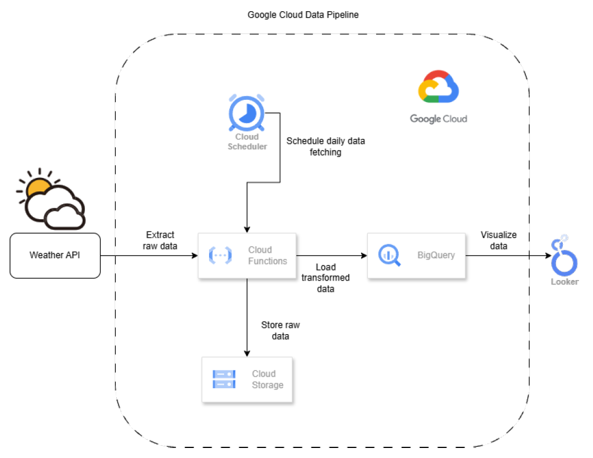
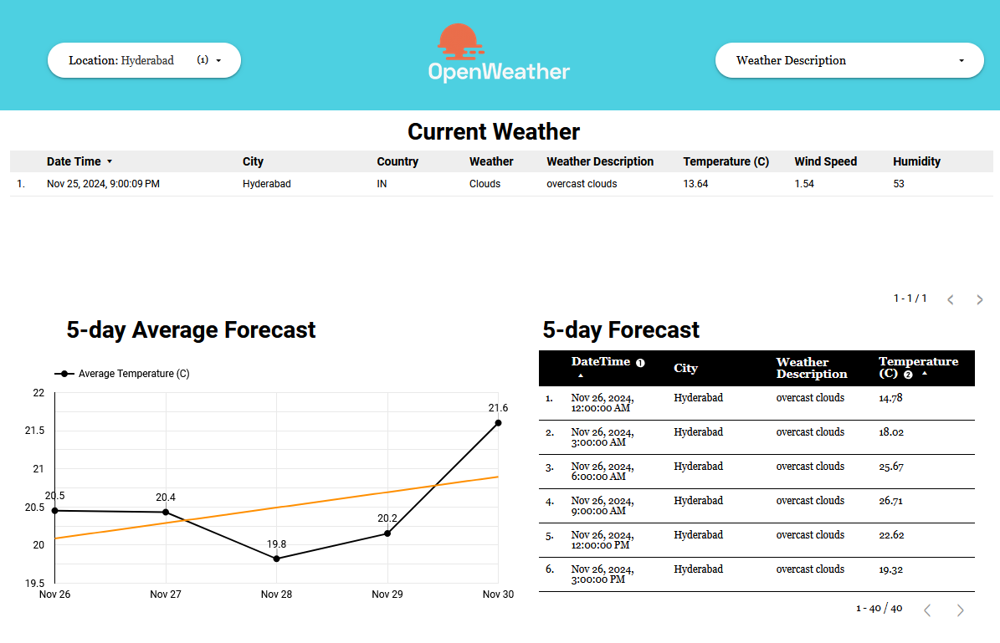

# Weather Data GCP Pipeline

## 📌 Project Statement
This project builds an automated ETL (Extract, Transform, Load) pipeline for collecting, processing, and analyzing weather data using Google Cloud Platform (GCP). It retrieves real-time weather data from the OpenWeather API, transforms it with Python, stores it in BigQuery, and visualizes insights using Looker Studio.

## 📝 Project Workflow Overview
1. **Data Collection:** Fetch weather data from OpenWeather API.
2. **Data Processing:** Clean and transform data using Python and Pandas.
3. **Data Storage:** Store raw data in Cloud Storage and structured data in BigQuery.
4. **Automation:** Use Cloud Functions and Cloud Scheduler for automation.
5. **Visualization:** Create dashboards with Looker Studio.

    

## 🛠️ Tools & Technologies Used
- **Google Cloud Platform (GCP):** Cloud Functions, Cloud Storage, BigQuery, Cloud Scheduler, Looker Studio
- **Programming Language:** Python with Pandas
- **API Source:** [OpenWeather API](https://openweathermap.org/)

## 🚀 Methodology
### 1. **Data Retrieval**
- Collected weather data from OpenWeather API for multiple cities.

### 2. **Data Processing with Python**
- Flattened nested JSON responses into tabular format.
- Converted Unix timestamps to human-readable datetime.
- Structured data for BigQuery compatibility.

### 3. **Data Storage on GCP**
- **Raw Data:** Stored in Cloud Storage.
- **Structured Data:** Uploaded to BigQuery tables.

### 4. **Automation with Cloud Functions & Scheduler**
- **Cloud Functions:** Deployed Python scripts for ETL.
- **Cloud Scheduler:** Configured a CRON job to run every 4 hours.

### 5. **Data Visualization using Looker Studio**
- Created interactive dashboards displaying real-time trends and forecasts.

## ⚙️ Deployment Details
- **Cloud Function:** Memory: 512 MiB, Timeout: 3600 seconds, Autoscaling: 0-1 instances.
- **Cloud Scheduler:** CRON expression: `0 */4 * * *` (every 4 hours).

## 📚 References
- [OpenWeather API Documentation](https://openweathermap.org/api)
- [Google Cloud Platform Documentation](https://cloud.google.com/docs)
- [Looker Studio Guide](https://lookerstudio.google.com/)
- [Google Cloud Skills Boost](https://www.cloudskillsboost.google/)
